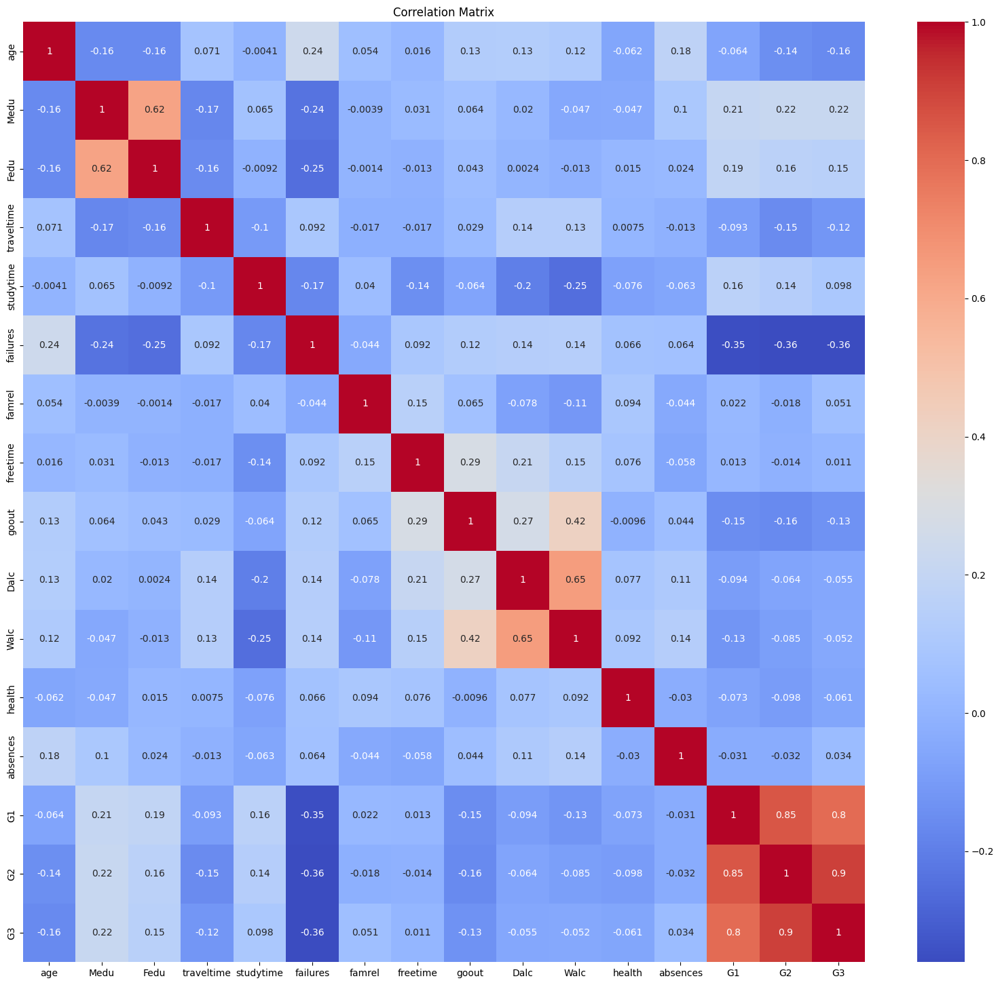
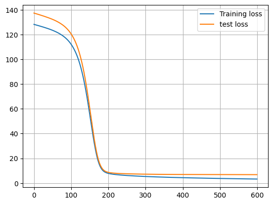
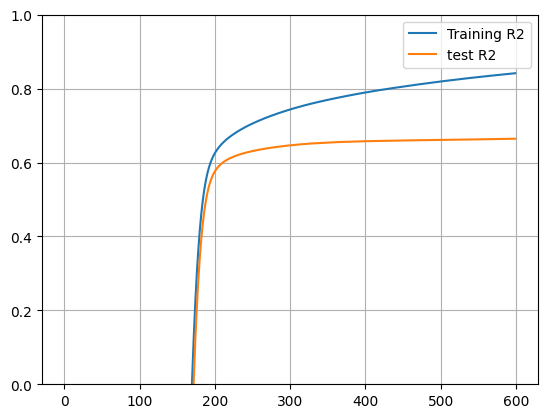

# Predicting Student Performance with MLP in PyTorch

This project implements a **Multilayer Perceptron (MLP) in PyTorch** to predict students’ final grades (`G3`) using the **Student Performance Dataset**. The dataset includes demographic, family, and academic background information of students.  

---

## 📂 Dataset

The dataset contains the following features:

- Demographics: `school`, `sex`, `age`, `address`, `famsize`, `Pstatus`
- Education background: `Medu`, `Fedu`, `Mjob`, `Fjob`, `reason`, `guardian`
- Study & activity: `traveltime`, `studytime`, `failures`, `schoolsup`, `famsup`, `paid`, `activities`, `nursery`, `higher`, `internet`, `romantic`
- Lifestyle & social: `famrel`, `freetime`, `goout`, `Dalc`, `Walc`, `health`, `absences`
- Academic performance: `G1` (1st grade), `G2` (2nd grade), `G3` (final grade → target)

---

## ⚙️ Data Preprocessing

1. **Missing values & duplicates** → None found.  
2. **Encoding categorical features** → One-hot encoding used for categorical columns.  
3. **Feature scaling** → Applied `StandardScaler` to normalize input features.  
4. **Correlation analysis** → Visualized correlation matrix to study relationships between features.

### Correlation Matrix  

---

## 🧠 Model Architecture

Implemented using PyTorch `nn.Sequential`:

- Input layer → number of features after encoding  
- Hidden layers → experiments with different sizes (e.g., `256-16`, `128-32`, `64-16`, etc.)  
- Activation functions tested: **ReLU, ELU, LeakyReLU, Tanh, Softplus**  
- Regularization → Dropout + L2 (`weight_decay`)  
- Output → single regression node (`G3` final grade)

---

## ⚡ Training Setup

- Optimizers tested: **SGD, Adam, Adadelta, ASGD, RMSprop, Rprop**  
- Loss functions: **MSELoss, L1Loss**  
- Learning rates: `0.0001 – 0.01`  
- Epochs: up to `600`  
- Batch size: `64`  

---

## 📊 Results

### 🔹 Loss Curves

Tracked training and testing loss for different optimizers, learning rates, and activation functions.

### Training vs Testing Loss (example: Adadelta, lr=0.01)  

Repeat similar plots for **Adam, SGD, RMSprop, etc.**

---

### 🔹 R² Score Curves

Evaluated performance using **R² score** for both training and test sets.

 

### Training vs Testing R² (example: Adadelta, lr=0.01)  

Repeat for other optimizers and activation functions.

---

---

## 🔹 Activation Function Comparison  

I experimented with multiple activation functions including **ReLU, ELU, LeakyReLU, Tanh, and Softplus**.  

- **ReLU**: Performed consistently well and showed stable convergence. It provided a balance between training speed and prediction accuracy.  
- **ELU**: Had smoother learning curves compared to ReLU but did not outperform it in final accuracy.  
- **LeakyReLU**: Helped mitigate the "dying ReLU" problem, but the performance gain was not significant.  
- **Tanh**: Struggled with convergence speed and tended to underperform compared to ReLU/ELU.  
- **Softplus**: Produced stable but slower learning, with results close to Tanh.  

📌 **Conclusion**: ReLU remained the most effective choice, offering higher R² scores and lower loss compared to the other tested functions.  

---

## 🔹 Optimizer Comparison  

Several optimizers were tested: **SGD, Adam, Adadelta, ASGD, RMSprop, and Rprop**.  

- **SGD**: Sensitive to learning rate. With tuned values, it showed decent results, but convergence was slower compared to Adam.  
- **Adam**: Achieved the best overall performance with faster convergence and more stable training. Adding **weight decay** further reduced overfitting.  
- **Adadelta**: Worked but showed no clear advantage over Adam or SGD.  
- **ASGD**: Had slow and unstable convergence; not ideal for this dataset.  
- **RMSprop**: Provided smoother convergence than SGD but still weaker than Adam.  
- **Rprop**: Showed fluctuations and was less reliable compared to Adam.  

📌 **Conclusion**: Adam outperformed all other optimizers, both in terms of convergence speed and predictive accuracy.  

---

---

## 🔍 Discussion

- **Adam** with **MSE loss** and a learning rate of `0.001` provided the most stable results.  
- Adding **L2 regularization (weight decay)** improved generalization and reduced overfitting.  
- **ReLU and ELU** activations performed better than Tanh and Softplus in terms of convergence speed.  
- Smaller learning rates (`0.0001`) slowed convergence, while larger ones (`0.01`) sometimes diverged.  

---

## 🚀 Future Work

- Experiment with **Cross-Entropy loss** if framing as classification (grade bands).  
- Introduce **early stopping** and **learning rate scheduling**.  
- Use **feature importance analysis** to interpret key factors influencing student performance.  
- Collect and integrate larger datasets to improve robustness.

---

## 📜 Citation

Student Performance Dataset:  
P. Cortez and A. Silva. *Using Data Mining to Predict Secondary School Student Performance*. EUROSIS, 2008.

---

## 🧑‍💻 Author

Developed by **Madadi. S**
